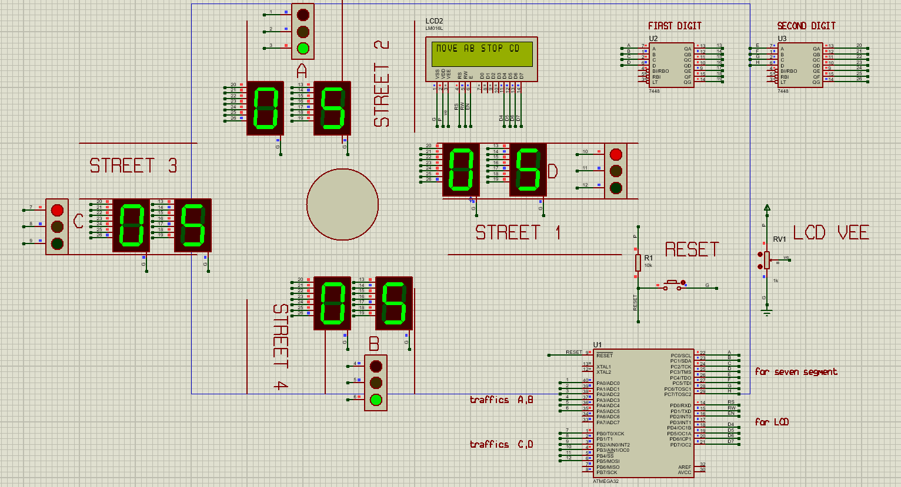
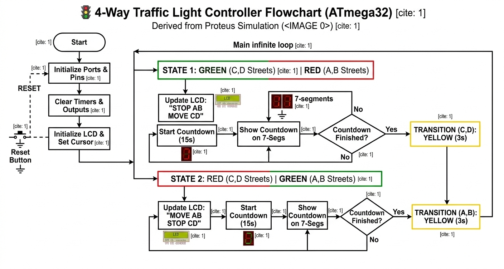

#  Intelligent 4-Way Traffic Control System (ATmega32)

##  System Demonstration

*Real-time simulation showing the synchronized transition between Green, Yellow, and Red phases with an active countdown.*

---

##  Project Overview
This project is an advanced **Traffic Management System** designed for a 4-way intersection. It utilizes the **ATmega32** microcontroller to manage complex timing logic, ensuring smooth traffic flow and safety through integrated visual feedback and high-precision synchronization.

---

##  Hardware Architecture & Components
The system is engineered with specific industrial-grade components to ensure reliability:

* **Microcontroller (The Brain):** **ATmega32** - An 8-bit AVR RISC-based MCU that handles all timing and I/O operations.
* **Visual Signaling:** **12 High-Intensity LEDs** (Red, Yellow, Green for each of the 4 streets).
* **Status Display:** **16x2 Character LCD** - Provides real-time textual instructions to drivers (e.g., "STOP AB", "MOVE CD").
* **Countdown Timers:** **Four Dual 7-Segment Displays** - Driven by **7448 BCD-to-7-Segment Decoders** to show remaining seconds while saving MCU pins.
* **User Interface:** External **Reset Push-Button** connected for manual system initialization.
* **Stability:** Includes a **1kΩ Potentiometer (RV1)** for LCD contrast adjustment and pull-up resistors for signal integrity.

###  Hardware & Logic Visualization
| **Proteus Simulation Schematic** | **Logic Flowchart** |
| :---: | :---: |
|  |  |

---

##  Software Logic & Code Explanation
The firmware (`main.c`) is designed as a **Finite State Machine (FSM)** to prevent any logical conflicts:

1. **State Machine Logic:** The code alternates priorities between two street groups (A-B and C-D) using structured loops.
2. **Countdown Sync:** A dedicated timer logic decrements the counter every 1 second and updates the 7-segment displays via the 7448 decoders.
3. **Safety Transitions:** Implements a **3-second Yellow light buffer** before any Green-to-Red switch to clear the intersection.
4. **Port Manipulation:** Uses efficient AVR-C port registers for ultra-fast response times in controlling the LCD and LEDs.

---

##  Project Structure
* `main.c`: The core C source code containing the timing logic.
* `traffic.pdsprj`: The Proteus project file for hardware simulation.
* `Animation.gif`: Recorded simulation demo of the working system.
* `protus_circuit.png`: High-resolution snapshot of the circuit design.
* `flowchart.png`: Visual representation of the programming logic.

##  How to Run
1. Open **`traffic.pdsprj`** in Proteus 8.10 or higher.
2. The simulation is pre-linked to the logic; however, you can re-compile **`main.c`** in Microchip Studio if needed.
3. Press the **Play** button in Proteus to watch the system in action!
